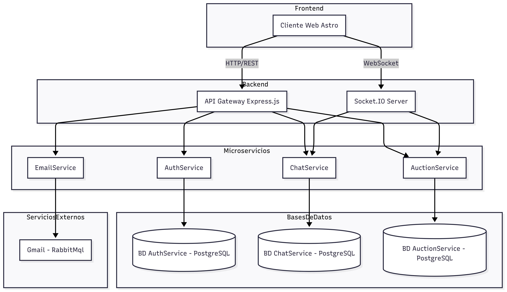

# Documentación de Arquitectura de Backend: Monolítica vs. Microservicios "Deal Online"

## Comparativo: Arquitectura Monolítica vs. Microservicios

## 1. Introducción

En el desarrollo de software, la arquitectura de un sistema es crucial para su escalabilidad, mantenimiento y evolución. Tradicionalmente, muchas aplicaciones se construían con una arquitectura monolítica. Sin embargo, para proyectos más complejos y distribuidos como "Deal Online", la arquitectura de microservicios ofrece ventajas significativas.

## 2. Arquitectura Monolítica

Una arquitectura monolítica es un enfoque de diseño donde todas las funcionalidades de una aplicación (interfaz de usuario, lógica de negocio, acceso a datos) se empaquetan en una única unidad de despliegue.

## 3. Arquitectura de Microservicios: "Deal Online"

La arquitectura de microservicios descompone una aplicación en un conjunto de servicios pequeños, independientes y débilmente acoplados. Cada microservicio se enfoca en una funcionalidad específica, se ejecuta en su propio proceso y se comunica con otros microservicios a través de APIs bien definidas.

## 4. Comparación General

| Característica                | Arquitectura Monolítica                           | Arquitectura de Microservicios                        |
|-------------------------------|---------------------------------------------------|------------------------------------------------------|
| **Estructura**                | Una sola aplicación con todo el backend integrado | Servicios independientes comunicándose entre sí       |
| **Escalabilidad**             | Escala en bloque, requiere replicar toda la app   | Escala de forma independiente por cada microservicio  |
| **Despliegue**                | Se despliega como un único artefacto              | Cada microservicio puede desplegarse de forma aislada |
| **Mantenimiento**             | Difícil, cambios afectan toda la aplicación       | Más sencillo, cambios acotados a un servicio          |
| **Tecnologías**               | Normalmente un único stack                        | Se pueden usar diferentes tecnologías por servicio    |
| **Tolerancia a Fallos**       | Si falla un módulo, cae toda la aplicación        | Fallos aislados al microservicio correspondiente      |
| **Comunicación**              | Llamadas internas                                | API REST / WebSocket / Mensajería                     |

---

## 5. Diagramas de Arquitectura

### 5.1 Arquitectura Monolítica

- **Acoplamiento:** Todos los componentes están fuertemente acoplados, lo que significa que un cambio en una parte del código puede afectar a otras.
- **Despliegue:** La aplicación completa debe ser desplegada cada vez que se realiza un cambio, incluso pequeño.
- **Escalabilidad:** Escalar la aplicación significa escalar toda la unidad, incluso si solo una parte del sistema está experimentando alta demanda.
- **Tecnología Única:** Generalmente, se utiliza una única tecnología o un conjunto muy limitado para todo el proyecto.

### 5.2 Arquitectura de Microservicios

### Explicación de Componentes y Tecnología Utilizada

La arquitectura "Deal Online" se basa en los siguientes componentes principales y tecnologías: 

#### API Gateway
- Es el orquestador principal y el punto de entrada para todas las peticiones externas. Redirige las solicitudes a los microservicios apropiados y maneja la autenticación y la seguridad. 
- **Tecnología:** Node.js con NestJS.
- **Puerto de Acceso:** http://localhost:3050

#### Microservicios Principales

- **Auth Service:** Gestiona el registro, inicio de sesión y verificación de usuarios.
  - **Tecnología:** Node.js (TypeScript)
  - **Base de Datos:** PostgreSQL (auth-db)
  - **Mensajería:** RabbitMQ

- **Auction Service:** Maneja la creación, listado y gestión de pujas para subastas.
  - **Tecnología:** Node.js (TypeScript)
  - **Base de Datos:** PostgreSQL (auction-db)

- **Chat Service:** Administra el historial de mensajes y la comunicación en tiempo real.
  - **Tecnología:** Node.js (TypeScript)
  - **Base de Datos:** PostgreSQL (chat-db)

- **Email Service:** Envío de correos electrónicos.
  - **Tecnología:** Node.js (TypeScript)
  - **Cola:** RabbitMQ (emails_queue)

#### RabbitMQ
- Broker de mensajes para comunicación asíncrona.
- **Puerto de gestión:** http://localhost:15672

#### Prometheus y Grafana
- **Prometheus:** Recolecta métricas de microservicios. http://localhost:9090
- **Grafana:** Visualiza métricas. http://localhost:3005

#### Docker y Docker Compose
- Cada microservicio y dependencia está empaquetado como contenedor.
- `docker-compose.yml` define toda la infraestructura.

### 5.3 Evolución: De Monolito a Microservicios

La evolución de un **monolito** hacia una **arquitectura de microservicios** en este proyecto se realizó en varias etapas:

1. **Monolito Inicial**
   - Todo el backend se encontraba en un único bloque de código.
   - Los módulos de autenticación, subastas, chat y notificaciones estaban acoplados.
   - Esto dificultaba la escalabilidad y el mantenimiento.

2. **Identificación de Dominios**  
   - Se analizaron las funcionalidades principales para separarlas en servicios:
     - **AuthService**: gestión de usuarios y autenticación con JWT.
     - **AuctionService**: control de subastas y pujas.
     - **ChatService**: mensajería en tiempo real.
     - **EmailService**: envío de notificaciones vía SMTP.

3. **Separación en Microservicios**  
   - Cada dominio se convirtió en un servicio independiente.
   - Se implementó un **API Gateway** (Express.js) para centralizar las peticiones.
   - Se añadió **Socket.IO** para la comunicación en tiempo real en subastas y chat.

4. **Seguridad y Comunicación**  
   - Se implementó un middleware para **validación de JWT** en cada microservicio.
   - Los servicios se comunican entre sí mediante REST y WebSocket, reduciendo el acoplamiento.

5. **Base de Datos y Notificaciones**  
   - Los microservicios acceden a **PostgreSQL** con sus propias consultas.
   - El **EmailService** se conecta a Gmail SMTP para notificaciones automáticas.

Este cambio permitió que el sistema sea **más escalable, seguro y fácil de mantener**, eliminando la dependencia de un único bloque monolítico.

---

## 6. Refactorización del Backend a Microservicios

El backend originalmente monolítico fue refactorizado siguiendo este enfoque:

1. **Identificación de Dominios**: Se dividió la lógica principal en módulos (Auth, Auction, Chat, Email).
2. **Separación de Responsabilidades**:
   - Se aislaron controladores y servicios que antes estaban juntos.
   - Cada módulo maneja su propia lógica y validaciones.
3. **Comunicación entre Servicios**:
   - Se habilitó un **API Gateway** con Express.js para gestionar las rutas REST.
   - Se incorporó **Socket.IO** para la mensajería en tiempo real.
4. **Autenticación Descentralizada**:
   - Se implementó un **middleware de autenticación** con JWT para proteger las rutas.
5. **Persistencia**:
   - Todos los servicios se comunican con **PostgreSQL**, pero cada uno a través de su propio esquema de acceso.
6. **Notificaciones Externas**:
   - El servicio de correo (EmailService) se conecta vía SMTP a Gmail para alertas y confirmaciones.

## 7. Conclusión

La migración de la arquitectura monolítica hacia microservicios permitió:

- Aumentar la **escalabilidad** mediante servicios independientes.
- Mejorar la **mantenibilidad** separando responsabilidades.
- Integrar **comunicación en tiempo real** con Socket.IO.
- Proteger rutas con **JWT**.
- Incorporar servicios externos como **Gmail SMTP** para notificaciones.
